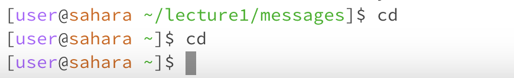
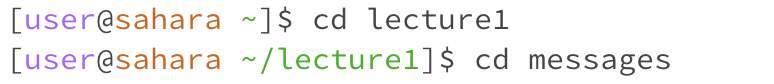
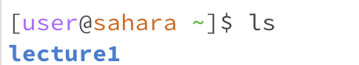
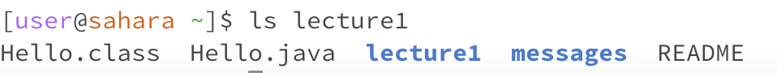
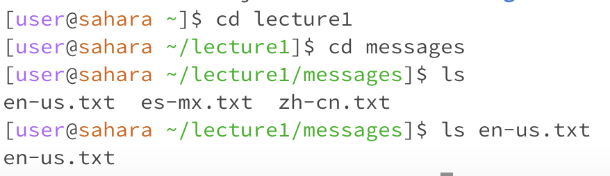
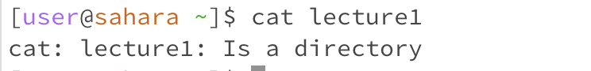
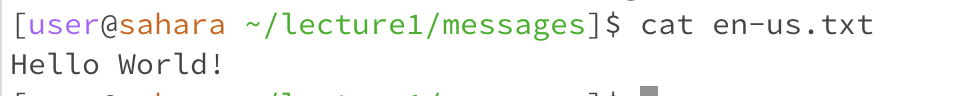

# Laboratory 1
## What will we cover?
- cd command
- ls command
- cat command

# The "cd" Command Allows You to Change Your Directory

## "cd" Command With No Argument

- In this example, the "cd" command with no argument will result in two things: if you are already in a working directory, it will clear your directory and bring you to the root directory; if you are only in the root directory you will stay there since you are not providing an argument for the directory to change too. For this example we go from the messages directory back to the root. Then once in the root directory we run the cd command again and it doesnt change the directory.

## "cd" Command With a Path to a Directory as an Argument

- In this example, the "cd" command with a directory as the argument will change your directory to the one given in the argument, assuming it exists and is accessible. In this example we go from the root directory to the lecture1 directory.

## "cd" Command With a Path to a File as an Argument

- In this example, the "cd" command with a file as the argument will return an error since a file isn't a directory.
# The "ls" command list files

## "ls" Command With No Argument

- In this example, the "ls" command with no argument will list the files and directories it is able to access from the current directory. In this example we are in the root directory and we are able to access the lecture1 directory using ls.

## "ls" Command With a Path to a Directory as an Argument

- In this example, the "ls" command with a directory as the argument will list the files and directories in the directory provided. In this example we are in the root directory and use the lecture1 argument, we can see the files and directory in the lecture1 directory.

## "ls" Command With a Path to a File as an Argument

- In this example, the "ls" command with a file as the argument will list the file's name being provided. In this example we are in the messages directory and we ls to see the files in the directory.

# The "cat" Command Returns the Text in the File

## "cat" Command With No Argument

- In this example, the "cat" command with no argument will allow you to type in the terminal and return what you typed, since we are in the root directory.

## "cat" Command With a Path to a Directory as an Argument

- In this example we are in the root directory, the "cat" command with a directory as the argument will return an error since it doesn't take directories as arguments. 

## "cat" Command With a Path to a File as an Argument

- In this example we are in the messages directory, the "cat" command with a file as the argument will return the text in the file.
