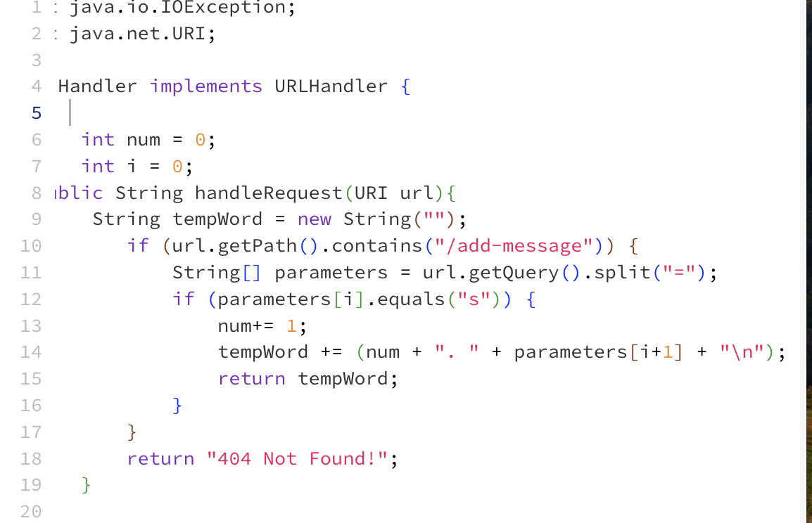

# Labrotory 2

## Part 1
## StringServer Program

- This is the code needed to allow you to add messages to the server. 

## StringServer In Use

- This is the result of the server being created and then using the “/add-message?s=Hello”. The primary method being used when you use the “/add-message” at the end of the url, is handlRequest. This method’s purpose is to see if the url contains the “/add-message” command, if it contains the command it will split the url by the “=” sign, then the code will check if the first parameter after the “=” is “s”. If it is, the method increments the value of the “num” integer by 1 and adds the correct format with the parameter increased by 1 to “tempWord”(an empty string). If any of these cases arent true it will return an error message.

- This is the result of using the “/add-message?s=How are you” command after using the “/add-message?s=Hello” command. For the most part both “/add-message” commands do the same thing. I don’t understand why the spaces are treated as “+” instead of “ ”, I think it has to do with the html web address bar not converting properly. I think the more inputs you add the “num” integer will increase in size everytime you add one. The values arent changed and are treated as strins.

## Part 2

- This is an image of the file path on my computer showing where the key is.
- 

- This is an image of the file path on my virtual computer showing where the key is.
- 

- This is the proof that I don't need to type my password when logging into my Vm

## Part 3
- I have learned a lot in week 2 and 3. I have learned how to list a user's input on a website, I got a better understanding of how to navigate through a vm and my own computers files, I have also gained a better understanding at creating keys on a computer.

