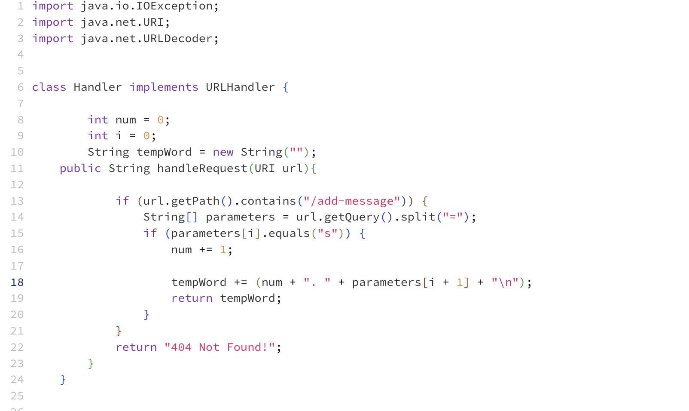
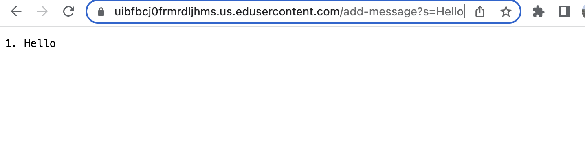
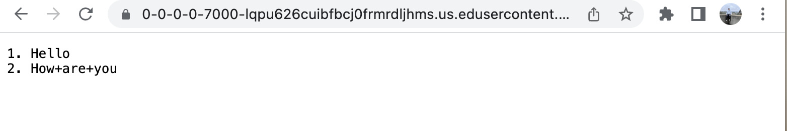
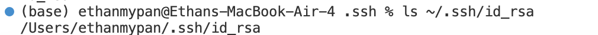
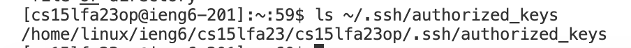
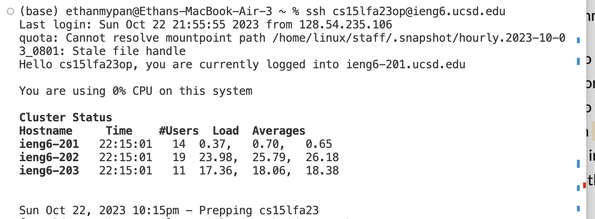

# Labrotory 2

## Part 1
## StringServer Program

- This is the code needed to allow you to add messages to the server. The fields of the class Handler are num, i, and tempWord.

## StringServer in Use

- This is the result of the server being created and then using the “/add-message?s=Hello”. The primary method being used when you use the “/add-message” at the end of the url, is handlRequest. This method’s purpose is to see if the url contains the “/add-message” command, if it contains the command it will split the url by the “=” sign, then the code will check if the first parameter after the “=” is “s”. If it is, the method increments the value of the “num” integer by 1 and adds the correct format with the parameter increased by 1 to “tempWord”(an empty string). If any of these cases aren't true it will return an error message. 
## StringServer With Argument "Hello"
- In this screenshot, the argument being provided is "add-message?s=Hello", since the argument contains "add-message", it will split the argument at the "=", then checks if "s" is there (for our example "s" is there), since "s" is there "num" will be incremented by 1, "tempWord" will have a string appended to it (num + ". " + parameters[i + 1] + "\n"), for our example ("1. Hello), the reason "Hello" is added and not "i", is because the next parameter is Hello. To wrap it all up, the values of the field before were "num" = 0, "i" = 0, and "tempWord" = "", and after the program runs they are "num" = 1, "i" = 0, and "tempWord" = "1. Hello".

## StringServer With Argument "How are you"

- In this screenshot, the argument being provided is "add-message?s=How are You", since the argument contains "add-message", it will split the argument at the "=", then checks if "s" is there (for our example "s" is there), since "s" is there "num" will be incremented by 1, "tempWord" will have a string appended to it (num + ". " + parameters[i + 1] + "\n"), for our example ("2. How are you), the reason "How are you" is added and not "i", is because the next parameter(i + 1) is "How are you". To wrap it all up, the values of the field before were "num" = 1, "i" = 0, and "tempWord" = "1. Hello", and after the program runs they are "num" = 2, "i" = 0, and "tempWord" = "1. Hello \n 2. How are you".

## Part 2

## Private Key

- This is an image of the file path on my computer showing where the private key is.
## Public Key

- This is an image of the file path on my virtual computer showing where the public key is.
## Proof of Not Needing Password

- This is the proof that I don't need to type my password when logging into my VM.

## Part 3
- I have learned a lot in week 2 and 3. I have learned how to list a user's input on a website, I got a better understanding of how to navigate through a VM and my own computer's files, and I have also gained a better understanding of creating keys on a computer.

