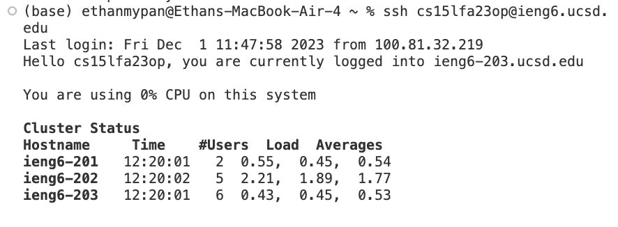
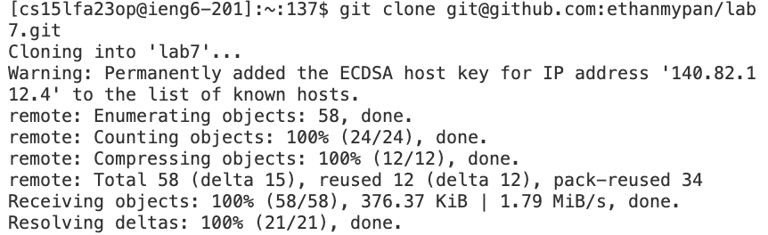
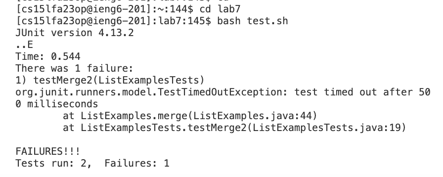
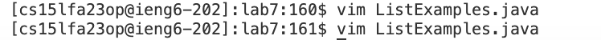
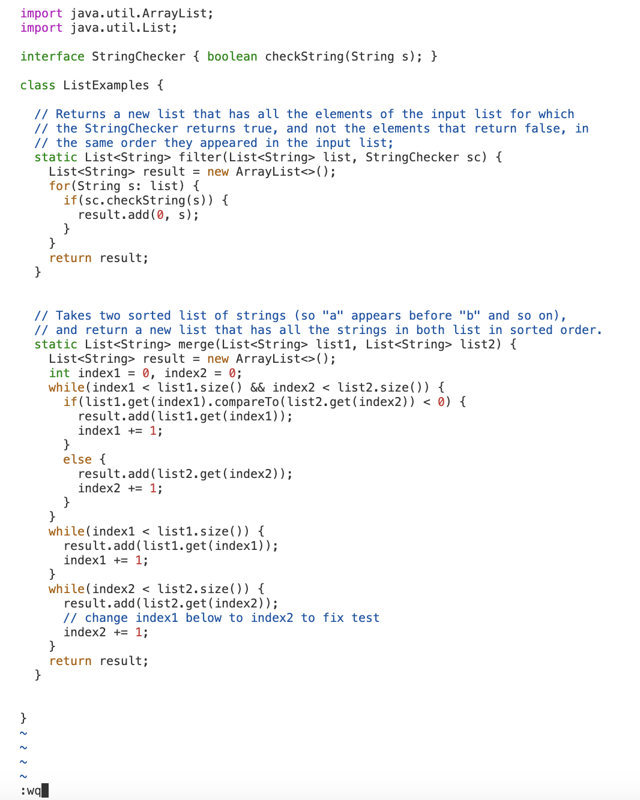
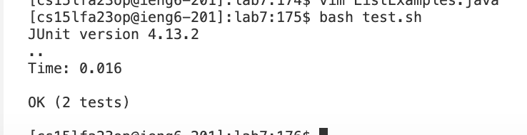
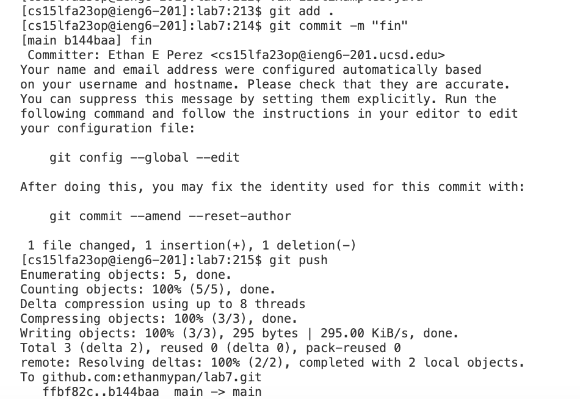

# Disclaimer 
I completed this lab report assuming I didn't have to say that I typed spaces, and '+' is used to symbolize using a combination of key presses.
## Step 1
Keys pressed:
```ruby
ssh cs15lfa23op@ieng6.ucsd.edu <enter>
```
Output:


Explanation:
For this step, I SSH'd into my virtual machine using the ssh cs15lfa23op@ieng6.ucsd.edu command.
When you use this command you log into your virtual machine.

## Step 2

Keys pressed:
```ruby
I typed git clone <command+v> <enter>. I had "git@github.com:ethanmypan/lab7.git" copied on my computer for this command.
```
Command: 
```ruby
git clone git@github.com:ethanmypan/lab7.git
```
Output:


Explanation:

## Step 3

Keys pressed:
```ruby
I typed cd lab7 <enter>, then I typed bash test.sh <enter>. 
```
Command:
```ruby
cd lab7
bash test.sh
```
Output:


Explanation:

## Step 4: 

Keys pressed:
```ruby
I typed vim ListExamples.java <enter> in the terminal, then once the file opened in vim I pressed 44 + <shift> + g, then I pressed control+a, and after that, I pressed <esc> then typed <shift> + ; then wq.
```
Command:
```ruby
vim ListExamples.java
44G
control+a
:wq
```

Output:



Explanation:
vim ListExamples.java opens the java file in vim so you can edit the file, then typing 44G will bring you to the 44th line, then I press control+a which increments the next closest number by 1 making the 1 into a 2, then I press <esc> so I leave the editing mode and the press:wq to save an close the file.


## Step 5:

Keys pressed:
```ruby
I typed bash test.sh <enter> in the terminal.
```

Command:
```ruby
bash test.sh
```

Output:


Explanation:
bash test.sh runs the test bash script that contains the code to run the JUnit tests.

## Step 6:

Keys pressed:
```ruby
I typed git add . <enter> into the terminal, then I pressed git commit -m <shift> + ' then typed fin then closed off the quotations with <shift> + ' <enter>, then I typed git push <enter>.
```

Command:
```ruby
git add .
git commit -m "fin"
git push
```

Output:


Explanation: 
"git add ." adds ListExamples.java to the git staging area, then git commit records the edits to git, then git push publishes the edits to your repository.


Commands Temp Save 

```ruby

```

Keys pressed: <up><up><up><up><enter>, <up><up><up><up><enter> The javac -cp .:lib/hamcrest-core-1.3.jar:lib/junit-4.13.2.jar *.java command was 4 up in the search history, so I used up arrow to access it. Then the java -cp .:lib/hamcrest-core-1.3.jar:lib/junit-4.13.2.jar org.junit.runner.JUnitCore ... command was 4 up in the history, so I accessed and ran it in the same way
