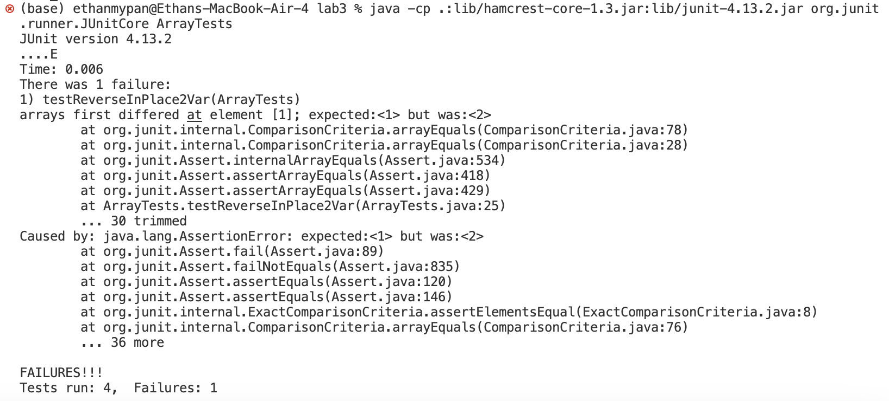

## Step 1
Command:
```ruby
Keys pressed: ssh cs15lfa23op@ieng6.ucsd.edu <enter>
```
Output:


Explanation:
For this step, I SSH'd into my virtual machine using the ssh cs15lfa23op@ieng6.ucsd.edu command.
When you use this command you log into your virtual machine .

Commands Temp Save 

```ruby

```
