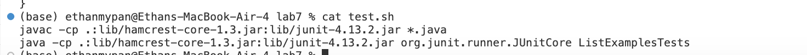

# Part 1
## Students Post
Code Failing Junit Test For Lab7
When I run bash test.sh my code fails the test. The error message I receive is array lengths differ, and I fail testMerge2. I think the error occurred in the merge class in my first while loop, the array isn't being sorted properly I think. Anyway, this is my code and symptom. Am I on the right track?


## Ta's Response
I think you are on the right track to making your code work. Try to find alternative ways to compare ```list1.get(index1)``` and ```list2.get(index2)```. Other than that, the rest of your code seems to be correct.

## Students Response
Thank you for the advice! I was able to find a different way to compare the indexes. I used compareTo instead, but it still doesn't work. I don't know why.


## Ta's Response
I believe the issue might be related to ```list1.get(index1).compareTo(list2.get(index2))``` returning an integer, when if statments need booleans as their conditions.

## Students Response
Thank you so much for the help. I was able to fix my problem, I made ```list1.get(index1).compareTo(list2.get(index2)) < 0``` be the condition for the if statement. The bug seemed to be that the if statement wasn't handling common elements correctly since it passed the first test but not the second. Using ```compareTo < 0```allows you to see if the elements are equal and if they are smaller or bigger than the value being compared to.

# Part 4 of Part 1
# file & directory structure needed


# The contents of each file before fixing the bug

## Contents of ListExamples.java


## Contents of test.sh


## Contents of ListExamplesTests.java


# The full command line (or lines) you ran to trigger the bug
I pressed ```cd lab7<enter>``` then ```bash test.sh<enter>``` to trigger the bug.


## A description of what to edit to fix the bug

All you have to do to fix the bug is change the ```.equals```. to ```.compareTo``` and then you have to make it ```< 0``` inside the if statement. Go from this ```list1.get(index1).equals(list2.get(index2))``` to ```list1.get(index1).compareTo(list2.get(index2))< 0```

## Reflection
I think the most interesting thing I learned from the second half of the quarter was using vim. I think vim is super useful and has multiple applications. Something I found interesting about vim is how many commands there are and how optimized you can make your experience if you learn the commands.
